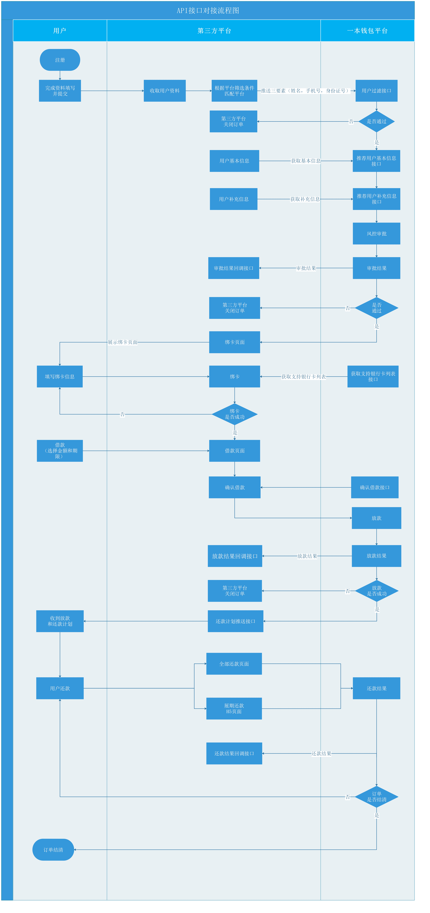

# API接入简述

## 1.引言

        平台（下称：平台）对合作机构推出借贷导航开放平台，合作机构可以在其内部系统无缝对接平台的用户资源数据。  
        合作机构通过平台系统API接口获取借款人和借款订单的相关信息（贷款人基本信息、征信信息、审核材料等），完成贷款订单的资质审核，同时合作机构向平台提供API实现订单的绑卡和还款操作，并通过接口最终反馈操作结果给平台

## 2.接入开放平台条件

1. 申请成为平台合作机构
2. 平台向机构提供借贷产品的相关产品数据和介绍信息
3. 获取平台接入标识（ua）、请求签名密钥（signkey）、测试用APP

## 3.接口总体说明

### **1.接口url**

#### **1.1测试环境地址**

http://www.zetafin.tech:9090/rest/channelApi

### 2.鉴权方式

1. 合作机构从开放平台获取平台接入标识（ua）和请求签名密钥（signkey）。
2. 平台接入标识和请求签名密钥由合作机构进行妥善保管以确保安全。
3. 双方每次API交互都需要做请求签名处理。请求数据签名主要采用MD5进行。

### **3.数据交互规范**

1. 双方均使用HTTP协议进行数据通信； 
2. 请求数据均使用POST方式发送（Content-Type: application/json）； 
3. 双方的接口响应数据字符集必须为utf8编码，且返回的数据各项必须为JSON格式字符串；

### 4.公共请求参数说明

| 参数名称 | 类型 | 必选项 | 参数说明 |
| :--- | :--- | :--- | :--- |
| ua | string | 是 | 开放平台分配给合作方的唯一标识 |
| args | JSON | 是 | 接口的调用参数, 要求必须为JSON String. |
| sign | string | 是 | 请求签名, 参考[附录-签名规则](fu-lu/qian-ming-gui-ze.md) |
| timeStamp | string | 否 | 以秒为单位的UnixTimestamp时间戳 |

```text
{
    ua:"YBQB_PARTNER_XL",
    args: { 
        "orderNo": "59841a25c768b00e27ba3226", 
        "approveResult": "OK",
    },
    sign:"{签名规则参考 接口请求签名章节}",
    timeStamp:"1500693926"
}
```

### 5.数据返回格式

返回的数据必须总是包含status和message字段，根据需要包含response字段。 接口响应示例数据结构：

```text
{
    status: 1,
    msg: "success",
    data:{
        "result": 200, 
        "loanMode": 0,
     }
}
```

### 6.借款流程



